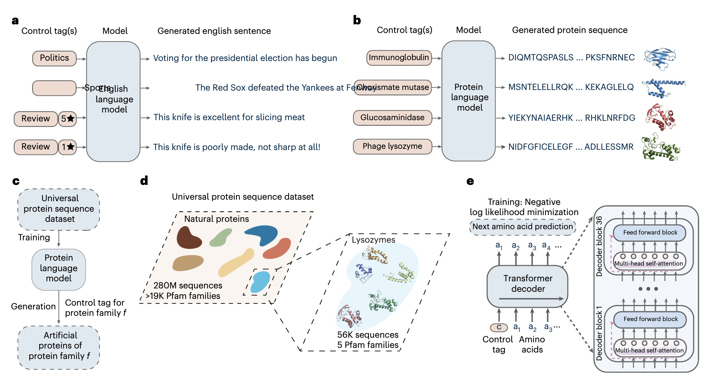

ProGen - 🚧 WORK IN PROGRESS 🚧
================

<!-- WARNING: THIS FILE WAS AUTOGENERATED! DO NOT EDIT! -->

Paper: [Large language models generate functional protein sequences
across diverse
families](https://www.nature.com/articles/s41587-022-01618-2)

I am currently working towards this paper. Check out my learning
progress here: https://twitter.com/xariusrke/status/1621403313651728386

### TODO

- \[DONE\] fast2dict
- Extract multiple properties of a protein sequence
- Tokenize the control tag
- Generate training data from dataset

### Questions

**Tokenizing** - Does the control tag use the same tokenizer as protein
sequence? - A control tag is represented by a token or multiple tokens?
If multiple tokens, then conditioned them all? - How to separate each
control tag? - Can the model predict the next control tag?

**Training**

### Resources

I implemented `ProGen` using these resources
